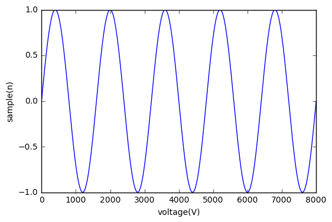

I was recently looking for a convenient way to integrate a jupyter notebook file into a jekyll blog post.
This would allow a faster workflow to publish code and work done in jupyter on a blog site powered by jekyll.

The key thing hereby is that jekyll uses markdown to create its website. Therefore the only thing you need to do is to convert your jupyter notebook into a markdown file and then putting this file into your posts directory of your blog site.

Open the shell and move to the directory of your jupyter notebook file - i called it `jekyll_test_post`. Then use the following command to convert it into a markdown file:

```sh
jupyter nbconvert jekyll_test_post.ipynb --to markdown
```
The output should look like:

````
[NbConvertApp] Converting notebook jekyll_test_post.ipynb to markdown
[NbConvertApp] Support files will be in jekyll_test_post_files/
[NbConvertApp] Making directory jekyll_test_post_files
[NbConvertApp] Writing 527 bytes to jekyll_test_post.md
```

 This creates an `jekyll_test_post.md` file and if you have graphics in your notebook it also creates a folder extended by *_files* (`jekyll_test_post_files`). As I have organized my graphics in the `images` folder of the jekyll folder structure, i move the files directory into this image folder. To properly show the plots, you now have to modify the source path to the plots.

 ``` md
 
 ```

Here is the result of the `jekyll_test_post.ipynb` file:

 ```python
 import matplotlib.pyplot as plt
 import numpy as np
 ```

 ```python
 Fs = 8000
 f = 5
 sample = 8000
 x = np.arange(sample)
 y = np.sin(2 * np.pi * f * x / Fs)
 ```

 ```python
 x
 ```


     array([   0,    1,    2, ..., 7997, 7998, 7999])


 ```python
 y
 ```


     array([ 0.        ,  0.00392698,  0.0078539 , ..., -0.0117807 ,
            -0.0078539 , -0.00392698])


 ```python
 plt.plot(x, y)
 plt.xlabel('voltage(V)')
 plt.ylabel('sample(n)')
 plt.show()
 ```


 
